# Image and alt-text index

Every image the public site shows, with the alt text it gets, grouped by page, for reviewing the alt text (docs/OPEN_QUESTIONS.md Q29). **Generated** by `pnpm content:image-index` (scripts/image-index.ts); do not edit by hand, re-run it after changing images or alt text.

How to change alt text:

- Images in page code: edit the `alt` in the file named in the *Used in* column (app/ and components/).
- Homepage cards and board headshots come from the database (seeded from the WordPress export by prisma/seed.ts). Their alt text is derived in the rendering component: cards are decorative (`alt=""`, the card title sits next to the image), headshots use the member's name. Change the derivation in the component; change the image or the name in `/admin` (or in the export before re-seeding).
- Open Graph share images (`pageMetadata({ image })`) are what Facebook, Slack, etc. show for a link; their alt is the `og:image:alt` tag.

Alt text on the old site existed only for sponsor logos and board headshots (the member's name); the rest was written during the migration from the image content and file names, so it needs a human check. Photo credits: none were shown on the old site and none were added (Q29).

**57 image uses** (44 distinct files) across 10 sections; **34 unreferenced files** in public/images (last section).

Thumbnails are relative links into public/images, so they render in GitHub and VS Code previews. Sizes are the committed files; next/image serves resized copies.

## Every page (app/layout.tsx)

| Thumbnail | File | Used in | Alt text | Notes |
|---|---|---|---|---|
| 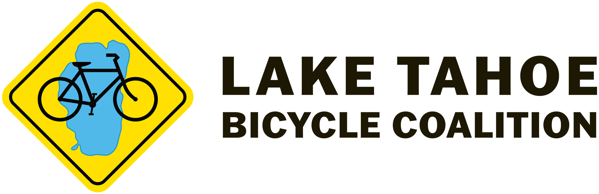 | `/images/2024/01/LTBC-Logo-new-2024.png` 2400x781, 39 KB | components/site-header.tsx:22 | Lake Tahoe Bicycle Coalition |  |

## /

| Thumbnail | File | Used in | Alt text | Notes |
|---|---|---|---|---|
| 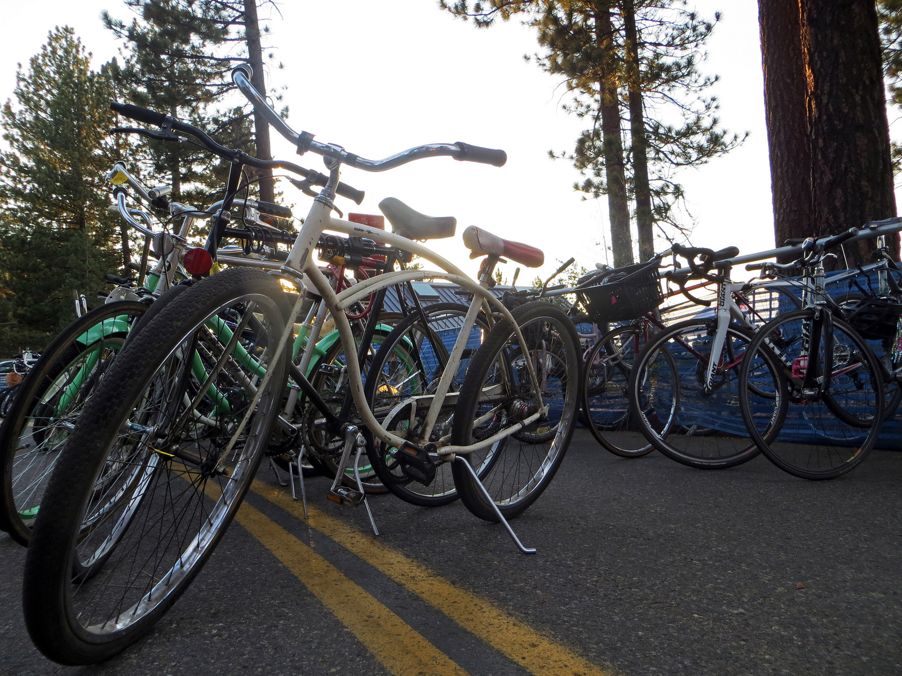 | `/images/2022/05/Lakeview-Valet.jpg` 1600x1200, 350 KB | app/page.tsx:20 (`galleryPhotos`) | Bikes parked at the Lake Tahoe Bicycle Coalition bike valet at Lakeview Commons | rendered by components/photo-gallery.tsx:30 |
| 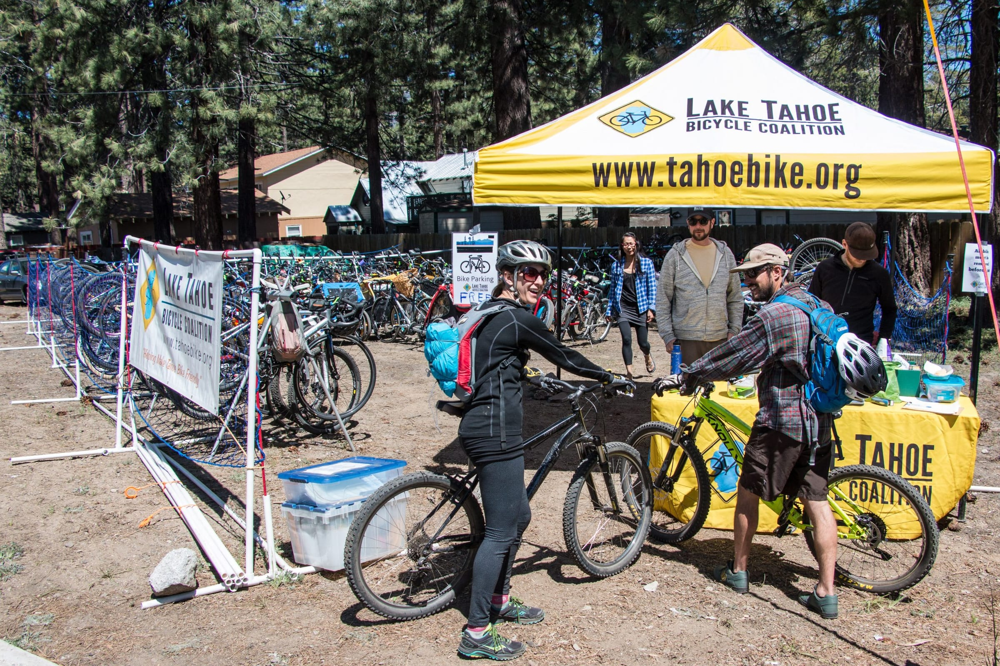 | `/images/2022/05/Bike-valet-in-action.jpg` 2400x1600, 863 KB | app/page.tsx:24 (`galleryPhotos`) | Volunteers checking in bicycles at a bike valet during a community event | rendered by components/photo-gallery.tsx:30 |
| 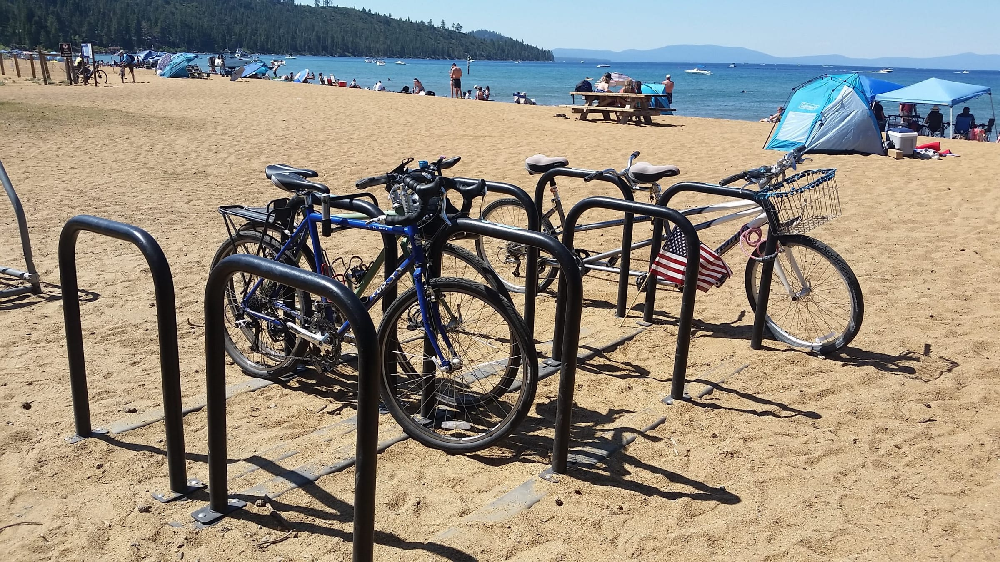 | `/images/2022/06/Baldwin-Beach.jpg` 2400x1350, 740 KB | app/page.tsx:28 (`galleryPhotos`) | Cyclists on the bike path near Baldwin Beach on Lake Tahoe’s south shore | rendered by components/photo-gallery.tsx:30 |
| 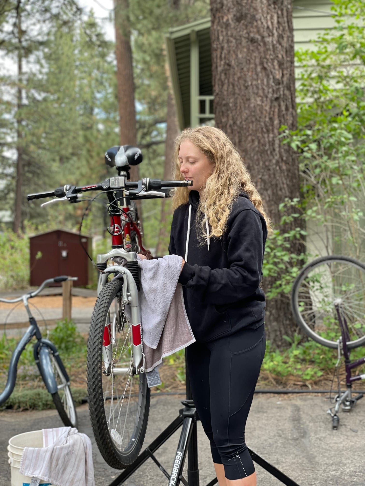 | `/images/2022/09/IMG_2848.jpg` 1512x2016, 335 KB | app/page.tsx:32 (`galleryPhotos`) | A volunteer working on a donated bicycle at a Bike Kitchen fix-up event | rendered by components/photo-gallery.tsx:30 |
| 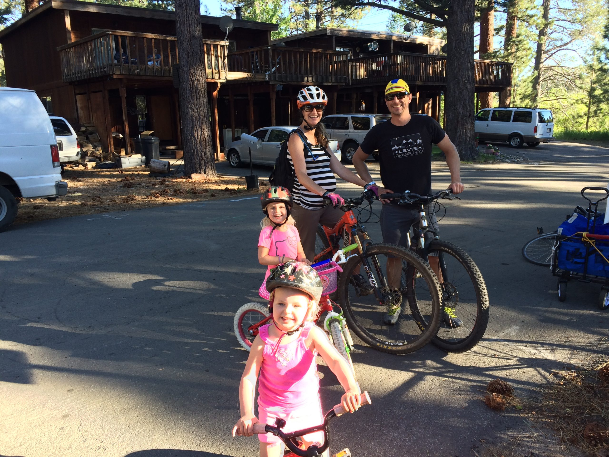 | `/images/2022/05/IMG_2041.jpg` 2400x1800, 641 KB | app/page.tsx:36 (`galleryPhotos`) | Riders gathered with their bikes at a Lake Tahoe Bicycle Coalition event | rendered by components/photo-gallery.tsx:30 |
| 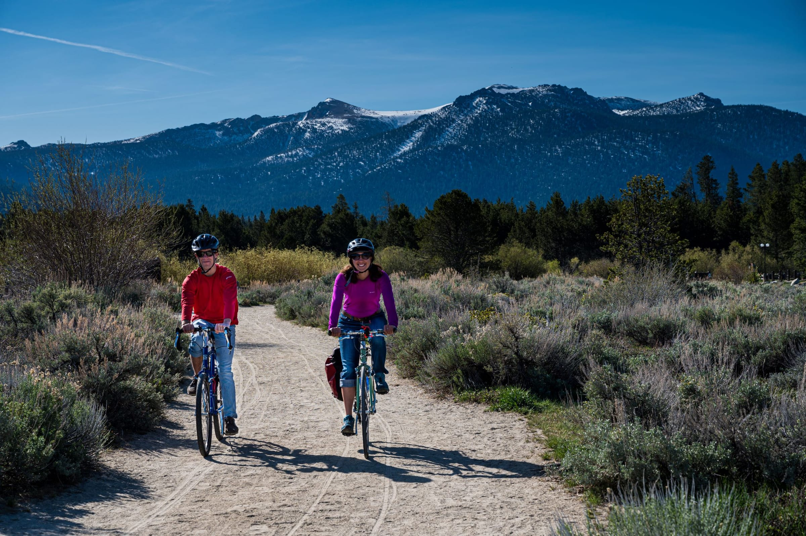 | `/images/2022/05/2020.05.07_Biking_Upper-Truckee-Marsh_California-Tahoe-Conservancy_DSC_2193.jpg` 2400x1597, 682 KB | app/page.tsx:40 (`galleryPhotos`) | Two people biking the path through the Upper Truckee Marsh with mountains behind | rendered by components/photo-gallery.tsx:30 |
| 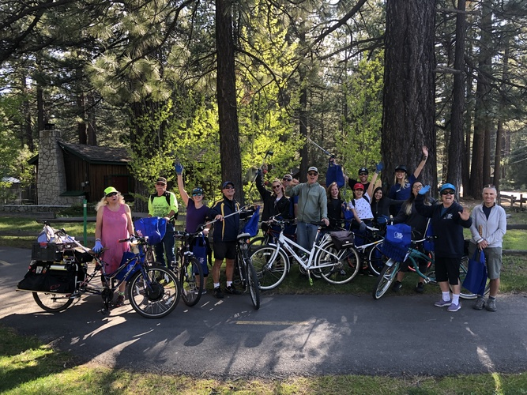 | `/images/2022/04/June-3-bike-path-cleanup.jpg` 667x500, 231 KB | app/page.tsx:44 (`galleryPhotos`) | Volunteers with rakes and bags cleaning up a Tahoe bike path | rendered by components/photo-gallery.tsx:30 |
| 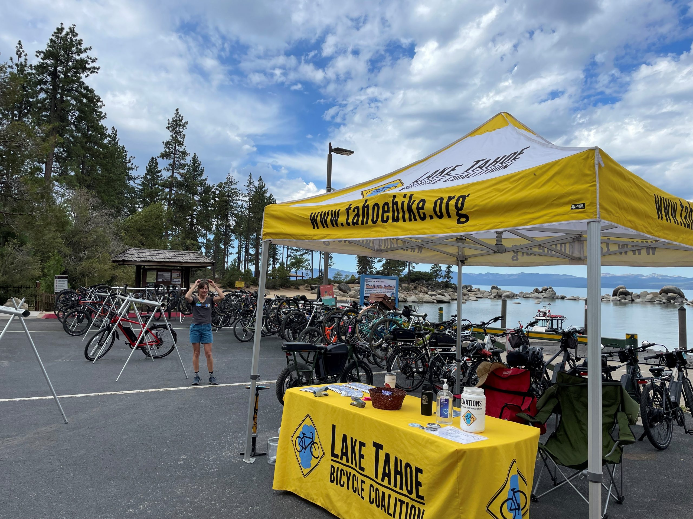 | `/images/2024/04/bike_valet2.jpg` 2400x1800, 638 KB | app/page.tsx:48 (`galleryPhotos`) | Rows of bicycles parked inside the fenced bike valet at an event | rendered by components/photo-gallery.tsx:30 |
| 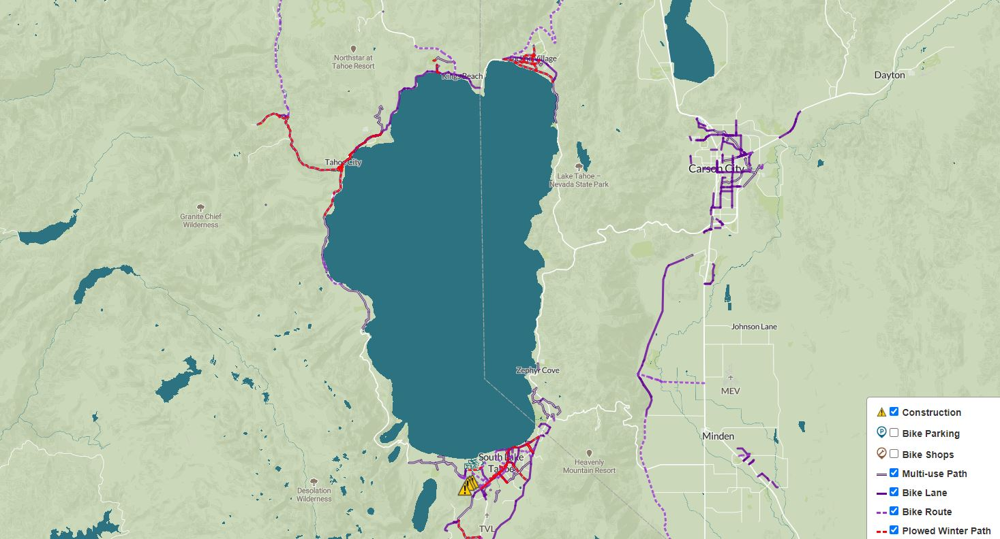 | `/images/2022/05/Bike-Map-screen.jpg` 1467x792, 151 KB | app/page.tsx:89 | Screenshot of the interactive Lake Tahoe Bikeways Map |  |
| 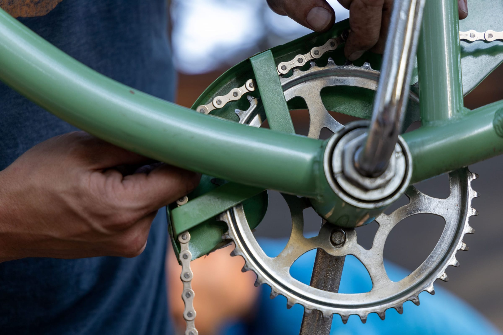 | `/images/2023/04/2022.09.01_bike-kitchen_5P6A2427_reduced.jpg` 2400x1600, 273 KB | homepage card "Join our Bike Kitchen Events" via seed | _decorative_ (`alt=""`) | prisma/seed.ts seedHomepageCards (HomepageCard.imageUrl); rendered by components/hero-cards.tsx:25 with alt "" |
| 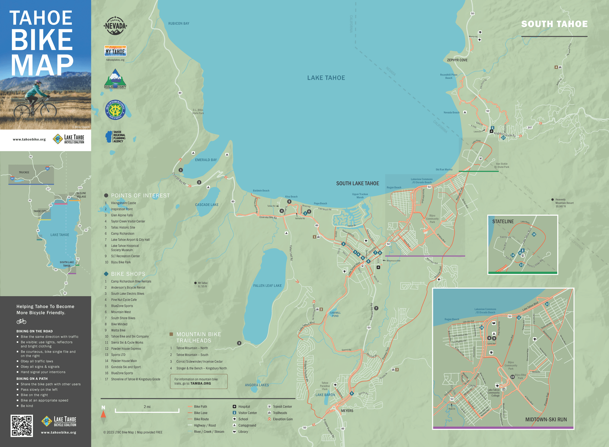 | `/images/2023/05/LTBC_SouthLake-2023-Print.png` 2400x1766, 1.05 MB | homepage card "Tahoe Bike Map" via seed | _decorative_ (`alt=""`) | prisma/seed.ts seedHomepageCards (HomepageCard.imageUrl); rendered by components/hero-cards.tsx:25 with alt "" |
|  | `/images/2022/05/Bike-valet-in-action.jpg` 2400x1600, 863 KB | homepage card "Join the Lake Tahoe Bicycle Coalition" via seed | _decorative_ (`alt=""`) | prisma/seed.ts seedHomepageCards (HomepageCard.imageUrl); rendered by components/hero-cards.tsx:25 with alt "" |
| 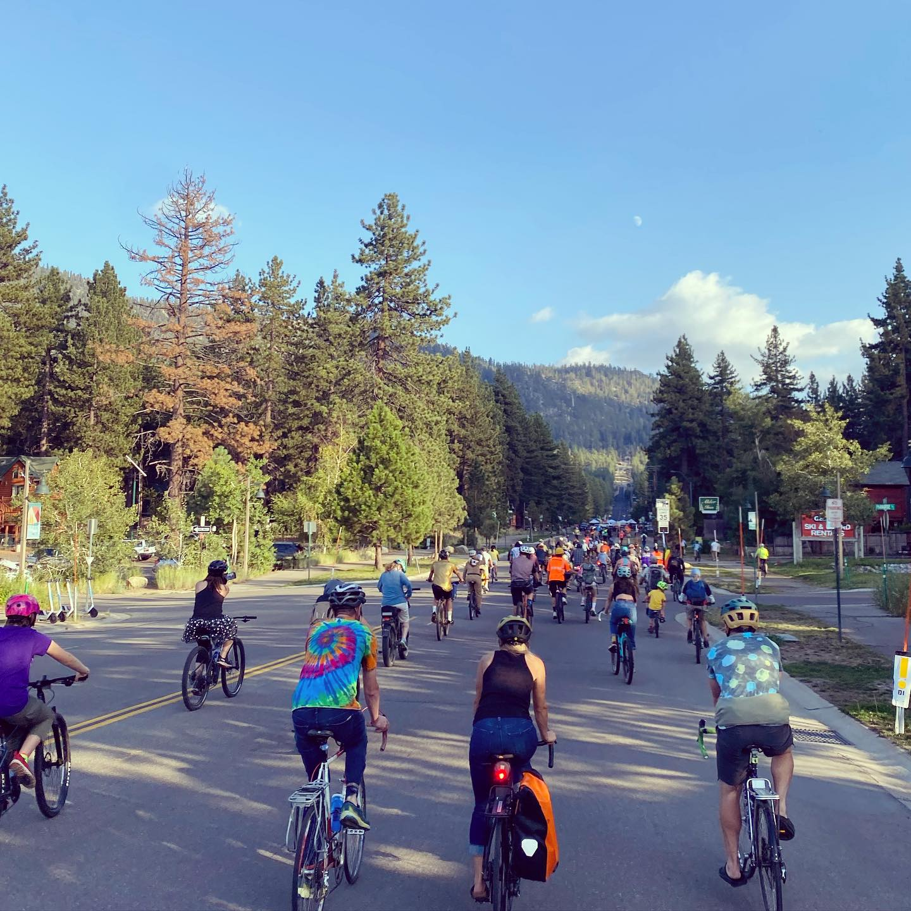 | `/images/2023/09/Critical-Mass.jpg` 1440x1440, 305 KB | homepage card "June is Tahoe Bike Month" via seed | _decorative_ (`alt=""`) | prisma/seed.ts seedHomepageCards (HomepageCard.imageUrl); rendered by components/hero-cards.tsx:25 with alt "" |

## /about

| Thumbnail | File | Used in | Alt text | Notes |
|---|---|---|---|---|
| 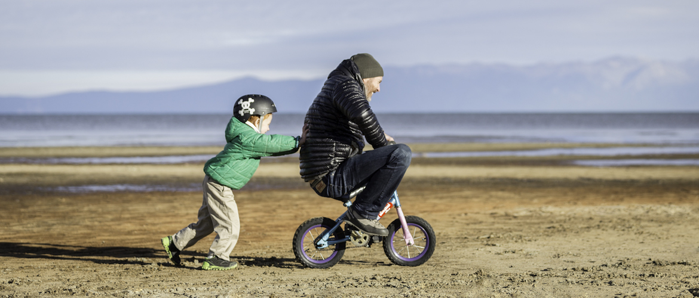 | `/images/2022/05/reichel-slider.jpeg` 1170x500, 83 KB | app/about/page.tsx:13 | A child pushes an adult riding a tiny kids' bike along the Lake Tahoe shore | Open Graph share image (`pageMetadata({ image })`); the alt is the og:image:alt tag |
|  | `/images/2022/05/reichel-slider.jpeg` 1170x500, 83 KB | app/about/page.tsx:43 | A child pushes an adult riding a tiny kids' bike along the Lake Tahoe shore |  |
|  | `/images/2022/05/2020.05.07_Biking_Upper-Truckee-Marsh_California-Tahoe-Conservancy_DSC_2193.jpg` 2400x1597, 682 KB | app/about/page.tsx:55 | Two cyclists riding a dirt trail through the Upper Truckee Marsh with snow-capped mountains behind |  |
| 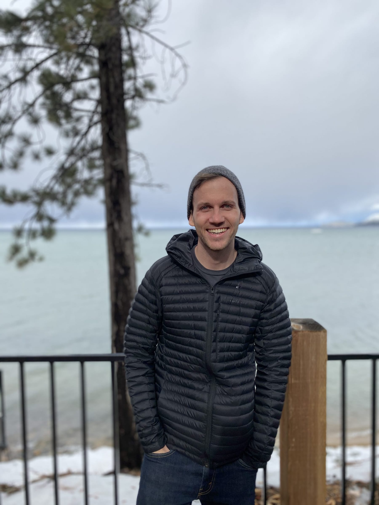 | `/images/2022/05/Nick-Speal.jpg` 1800x2400, 231 KB | board member Nick Speal via seed | Nick Speal | prisma/seed.ts seedBoard (BoardMember.photoUrl); rendered by components/board-roster.tsx:27 with alt {member.name} |
| 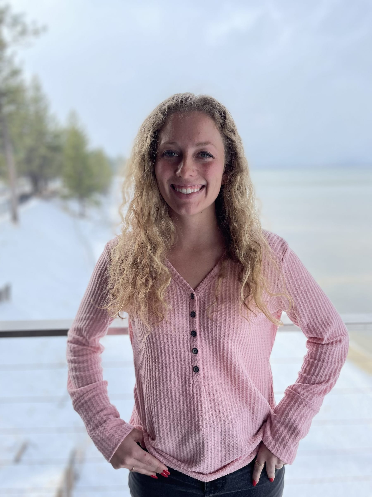 | `/images/2022/05/Kira-Smith.jpeg` 1800x2400, 316 KB | board member Kira Richardson via seed | Kira Richardson | prisma/seed.ts seedBoard (BoardMember.photoUrl); rendered by components/board-roster.tsx:27 with alt {member.name} |
| 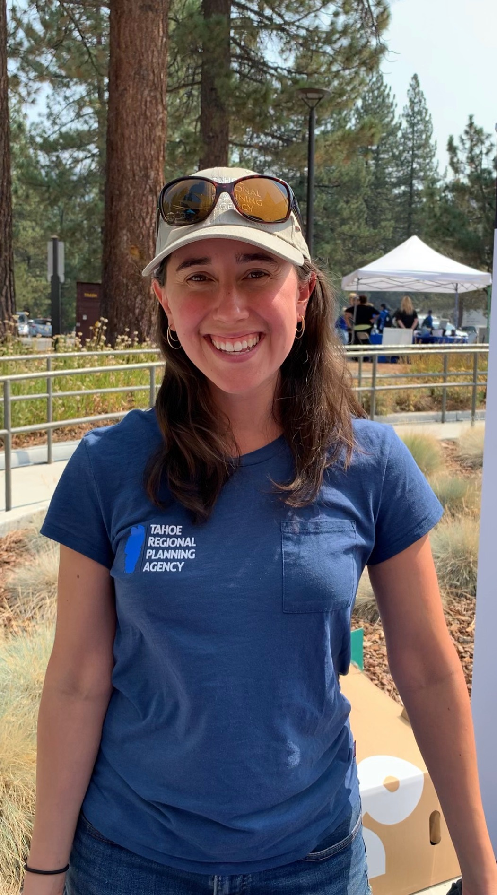 | `/images/2023/05/V-board-profile-2023.jpg` 1051x1893, 242 KB | board member Victoria "V" Ortiz via seed | Victoria "V" Ortiz | prisma/seed.ts seedBoard (BoardMember.photoUrl); rendered by components/board-roster.tsx:27 with alt {member.name} |
| 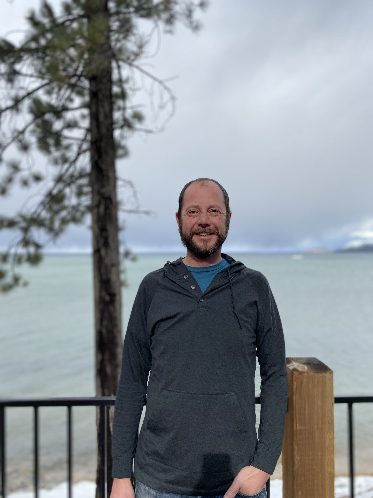 | `/images/2022/05/Gavin-Feiger.jpg` 1800x2400, 225 KB | board member Gavin Feiger via seed | Gavin Feiger | prisma/seed.ts seedBoard (BoardMember.photoUrl); rendered by components/board-roster.tsx:27 with alt {member.name} |
| 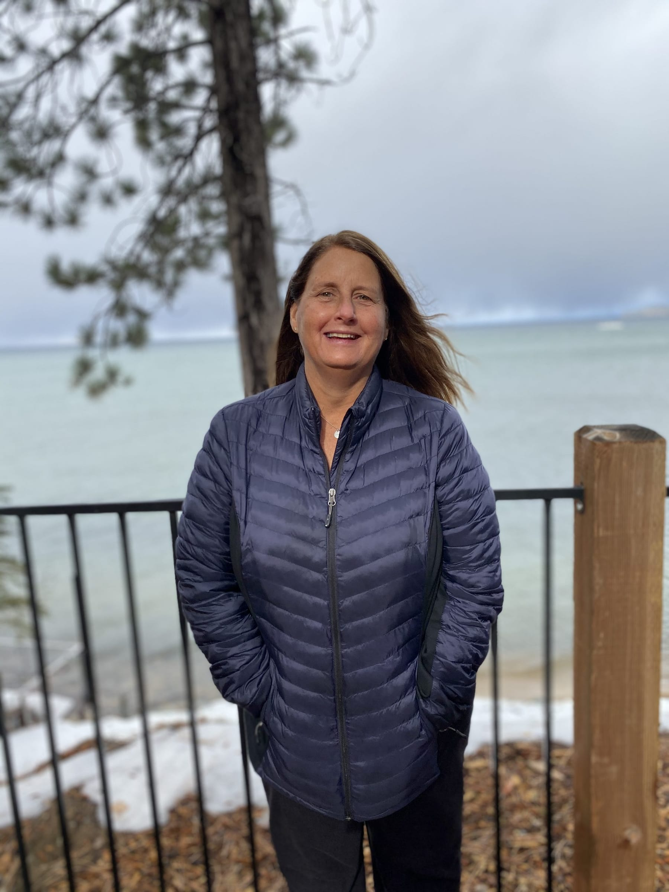 | `/images/2022/05/Nanette-Hansel-1.jpg` 1800x2400, 256 KB | board member Nanette Hansel via seed | Nanette Hansel | prisma/seed.ts seedBoard (BoardMember.photoUrl); rendered by components/board-roster.tsx:27 with alt {member.name} |
| 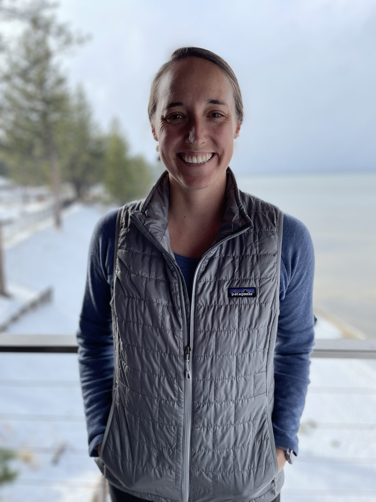 | `/images/2022/05/Carlie-Murphy.jpeg` 1800x2400, 252 KB | board member Carlie Murphy via seed | Carlie Murphy | prisma/seed.ts seedBoard (BoardMember.photoUrl); rendered by components/board-roster.tsx:27 with alt {member.name} |
| 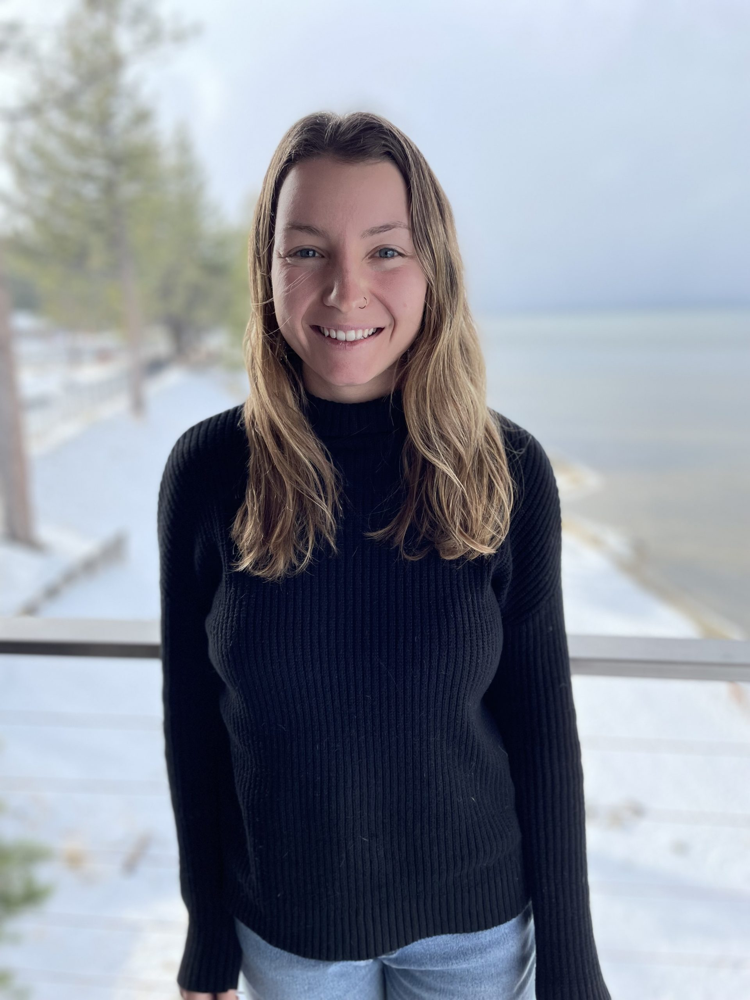 | `/images/2022/05/Amanda-Milici.jpeg` 1800x2400, 243 KB | board member Amanda Milici via seed | Amanda Milici | prisma/seed.ts seedBoard (BoardMember.photoUrl); rendered by components/board-roster.tsx:27 with alt {member.name} |
| 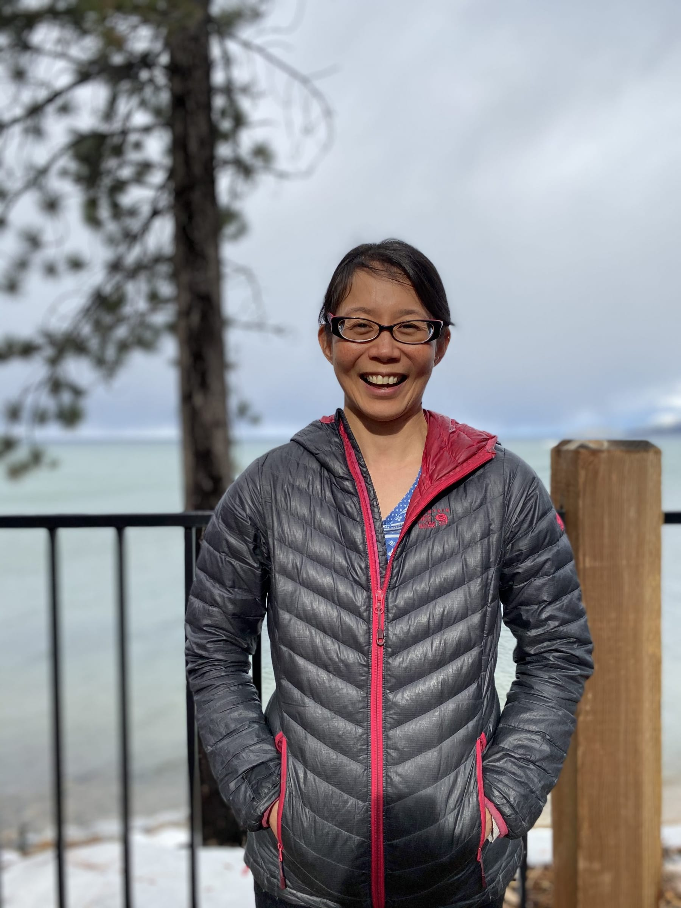 | `/images/2022/05/Sherry-Hao.jpg` 1800x2400, 312 KB | board member Sherry Hao via seed | Sherry Hao | prisma/seed.ts seedBoard (BoardMember.photoUrl); rendered by components/board-roster.tsx:27 with alt {member.name} |
|  | `/images/2022/05/Chris-Carney.jpg` 1800x2400, 447 KB | board member Chris Carney via seed | Chris Carney | prisma/seed.ts seedBoard (BoardMember.photoUrl); rendered by components/board-roster.tsx:27 with alt {member.name} |
|  | `/images/2022/05/Charles-Nelson-1.jpg` 1800x2400, 389 KB | board member Charles Nelson via seed | Charles Nelson | prisma/seed.ts seedBoard (BoardMember.photoUrl); rendered by components/board-roster.tsx:27 with alt {member.name} |
| 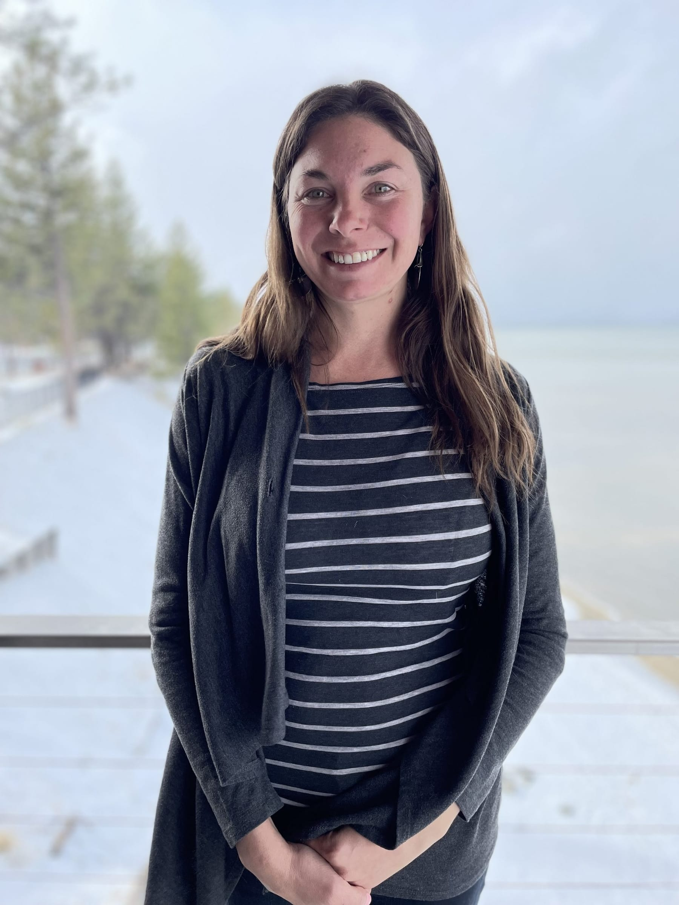 | `/images/2022/05/Sara-Monson.jpeg` 1800x2400, 299 KB | board member Sara Monson via seed | Sara Monson | prisma/seed.ts seedBoard (BoardMember.photoUrl); rendered by components/board-roster.tsx:27 with alt {member.name} |
| 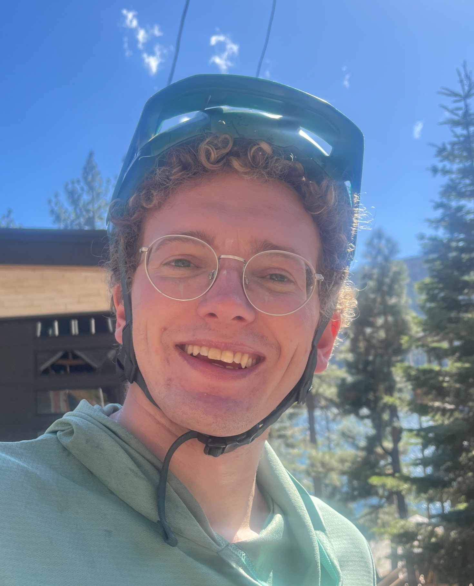 | `/images/2026/04/ian-marten.jpg` 1470x1815, 183 KB | board member Ian Marten via seed | Ian Marten | prisma/seed.ts seedBoard (BoardMember.photoUrl); rendered by components/board-roster.tsx:27 with alt {member.name} |

## /advocacy

| Thumbnail | File | Used in | Alt text | Notes |
|---|---|---|---|---|
| 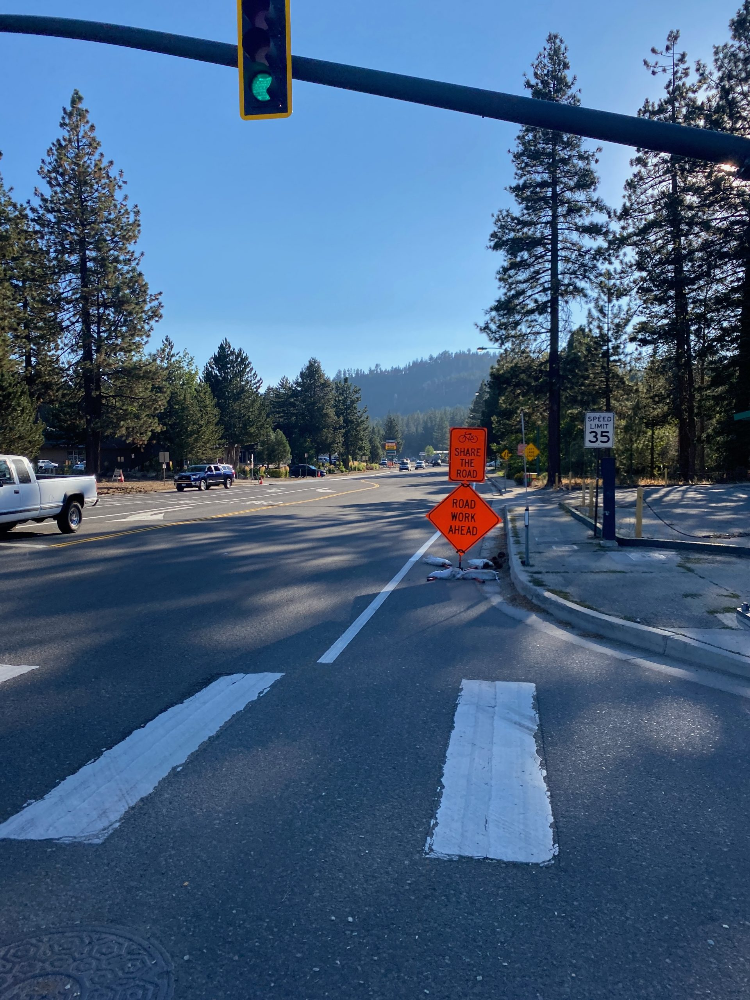 | `/images/2026/05/IMG_8347.jpeg` 1800x2400, 541 KB | app/advocacy/page.tsx:11 | A “Share the Road” sign beside a road-work sign at a signalized crosswalk on a Tahoe street | Open Graph share image (`pageMetadata({ image })`); the alt is the og:image:alt tag |
|  | `/images/2026/05/IMG_8347.jpeg` 1800x2400, 541 KB | app/advocacy/page.tsx:27 | A “Share the Road” sign beside a road-work sign at a signalized crosswalk on a Tahoe street |  |

## /bike-racks

| Thumbnail | File | Used in | Alt text | Notes |
|---|---|---|---|---|
| 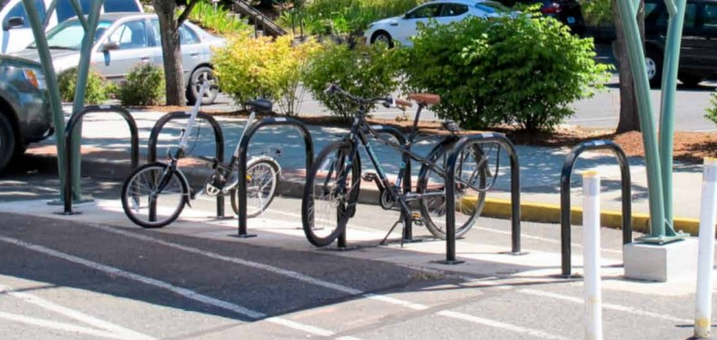 | `/images/2022/06/bike-rack.jpg` 793x376, 98 KB | app/bike-racks/page.tsx:11 | A row of bicycles parked at an inverted-U bike rack | Open Graph share image (`pageMetadata({ image })`); the alt is the og:image:alt tag |
| 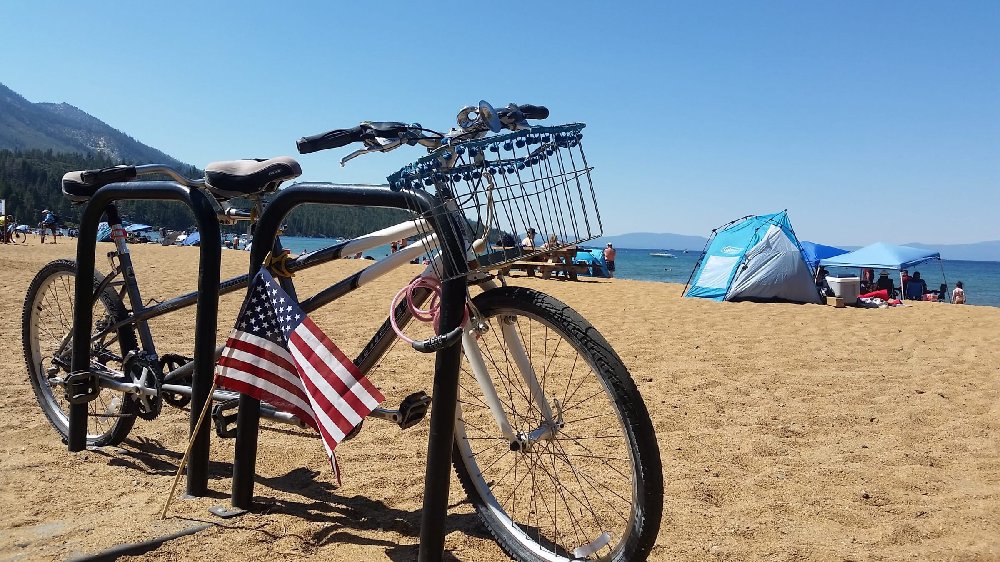 | `/images/2022/06/Patriotic-Tandem.jpg` 2400x1350, 555 KB | app/bike-racks/page.tsx:18 (`photos`) | A red, white and blue tandem bicycle locked to an inverted-U bike rack | rendered by app/bike-racks/page.tsx:116 |
| 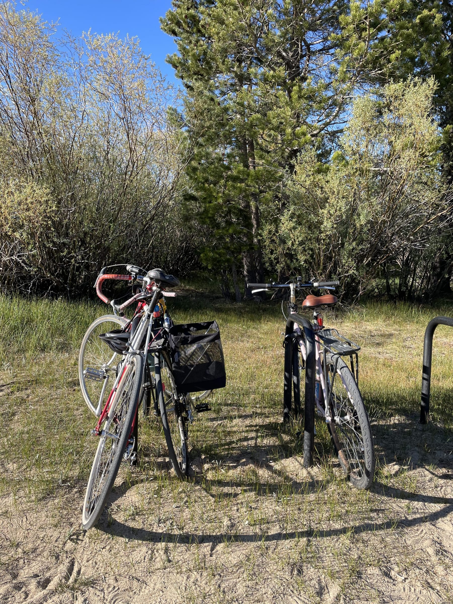 | `/images/2022/06/Cove-East-Rack-2.jpg` 1800x2400, 1.36 MB | app/bike-racks/page.tsx:22 (`photos`) | A new inverted-U bike rack installed at Cove East | rendered by app/bike-racks/page.tsx:116 |
|  | `/images/2022/06/Baldwin-Beach.jpg` 2400x1350, 740 KB | app/bike-racks/page.tsx:26 (`photos`) | Bicycles parked at the racks at Baldwin Beach | rendered by app/bike-racks/page.tsx:116 |
|  | `/images/2022/06/bike-rack.jpg` 793x376, 98 KB | app/bike-racks/page.tsx:41 | A row of bicycles parked at an inverted-U bike rack |  |

## /bike-safety

| Thumbnail | File | Used in | Alt text | Notes |
|---|---|---|---|---|
| 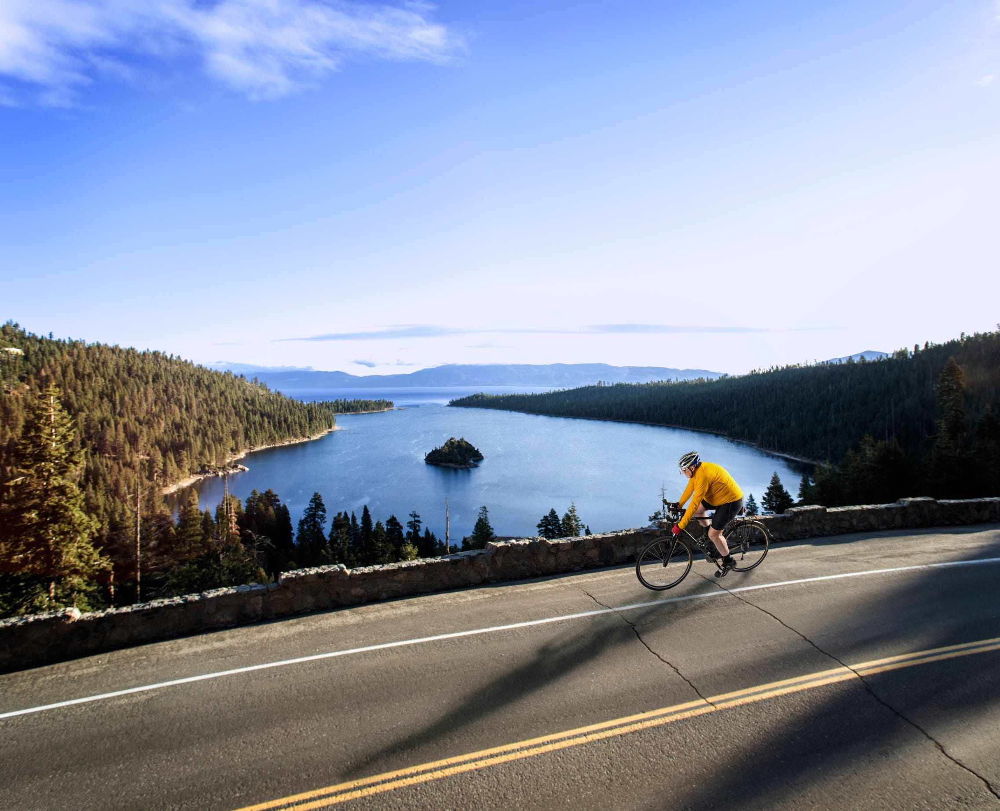 | `/images/2022/05/BSmeets_141113_90004-4.jpg` 2273x1844, 353 KB | app/bike-safety/page.tsx:11 | A road cyclist in a yellow jersey riding the highway above Emerald Bay | Open Graph share image (`pageMetadata({ image })`); the alt is the og:image:alt tag |
|  | `/images/2022/05/BSmeets_141113_90004-4.jpg` 2273x1844, 353 KB | app/bike-safety/page.tsx:75 | A road cyclist in a yellow jersey riding the highway above Emerald Bay |  |

## /print-bike-map

| Thumbnail | File | Used in | Alt text | Notes |
|---|---|---|---|---|
| 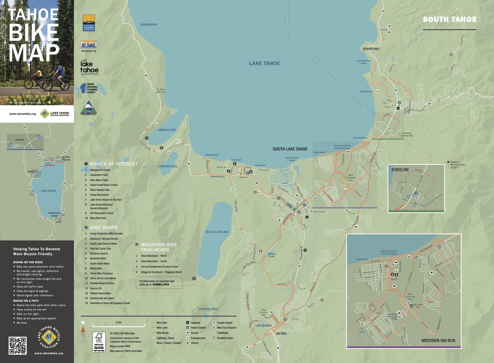 | `/images/2026/06/LTBC_SouthLake-2026-print.jpg` 1908x1404, 266 KB | app/print-bike-map/page.tsx:11 | South Tahoe bike map, 2026 print edition | Open Graph share image (`pageMetadata({ image })`); the alt is the og:image:alt tag |
| 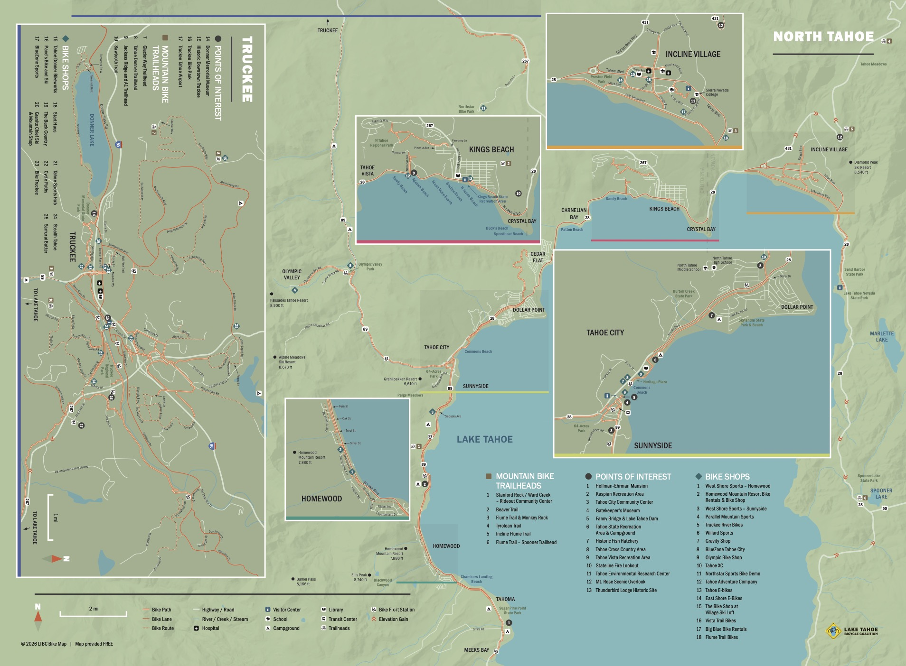 | `/images/2026/06/LTBC_NorthLake-2026-print.jpg` 1908x1404, 266 KB | app/print-bike-map/page.tsx:19 (`maps`) | Truckee / North Tahoe bike map, 2026 print edition (PDF, opens in a new tab) | rendered by app/print-bike-map/page.tsx:69; alt template {`${map.alt} (PDF, opens in a new tab)`} |
|  | `/images/2026/06/LTBC_SouthLake-2026-print.jpg` 1908x1404, 266 KB | app/print-bike-map/page.tsx:26 (`maps`) | South Tahoe bike map, 2026 print edition (PDF, opens in a new tab) | rendered by app/print-bike-map/page.tsx:69; alt template {`${map.alt} (PDF, opens in a new tab)`} |

## /programs/bike-kitchen

| Thumbnail | File | Used in | Alt text | Notes |
|---|---|---|---|---|
| 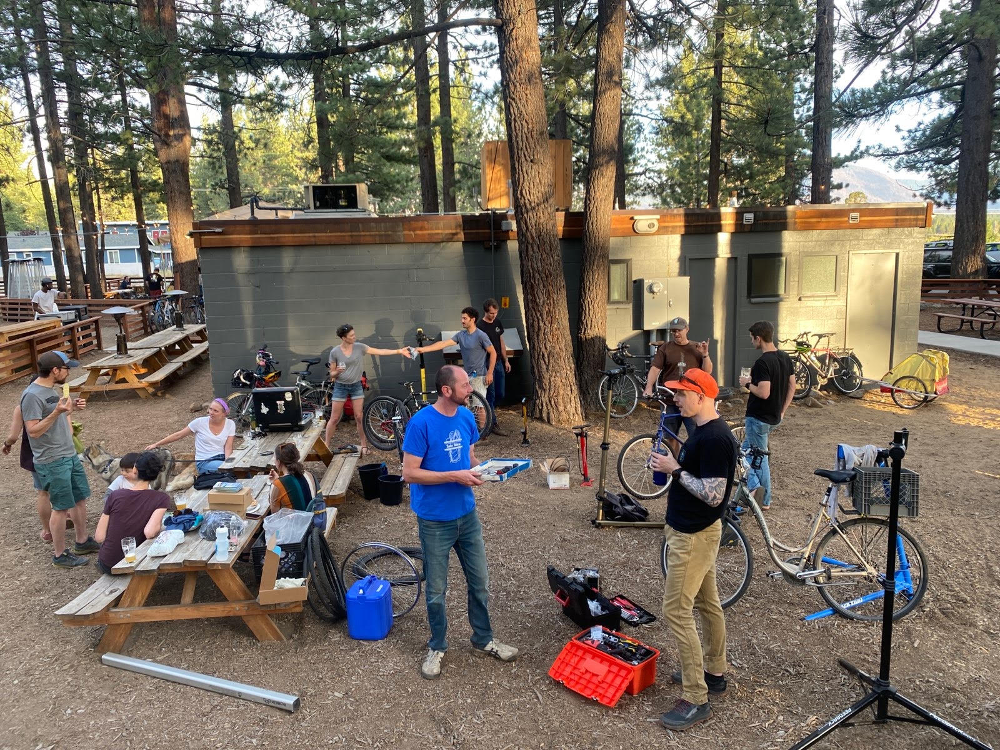 | `/images/2022/09/unnamed.jpg` 1600x1200, 512 KB | app/programs/bike-kitchen/page.tsx:14 | Volunteers repairing bikes on work stands at an outdoor Bike Kitchen fix-up event | Open Graph share image (`pageMetadata({ image })`); the alt is the og:image:alt tag |
| 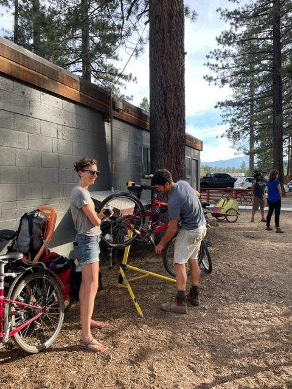 | `/images/2022/09/IMG_3107.jpg` 480x640, 96 KB | app/programs/bike-kitchen/page.tsx:21 (`gallery`) | Two volunteers fixing a bike on a repair stand outside a community building | rendered by app/programs/bike-kitchen/page.tsx:129 |
| 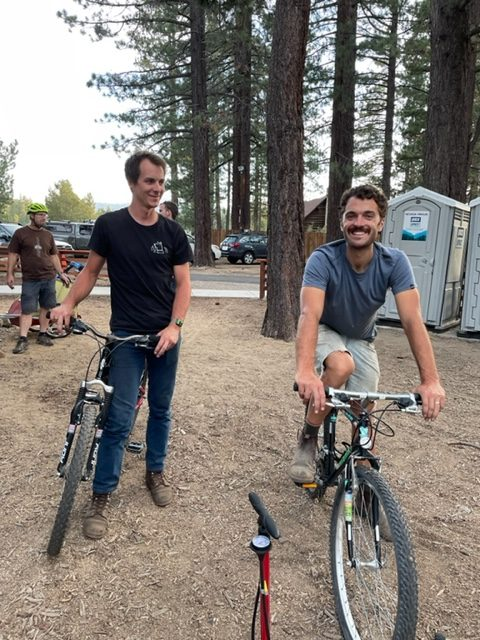 | `/images/2022/09/IMG_3110.jpg` 480x640, 96 KB | app/programs/bike-kitchen/page.tsx:25 (`gallery`) | Two smiling volunteers with refurbished bikes at a Bike Kitchen event | rendered by app/programs/bike-kitchen/page.tsx:129 |
| 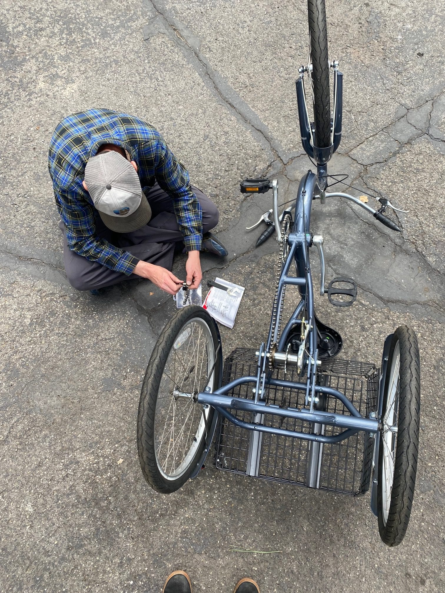 | `/images/2022/09/IMG_7376.jpg` 1512x2016, 861 KB | app/programs/bike-kitchen/page.tsx:29 (`gallery`) | A volunteer kneeling on the pavement to assemble an adult tricycle | rendered by app/programs/bike-kitchen/page.tsx:129 |
| 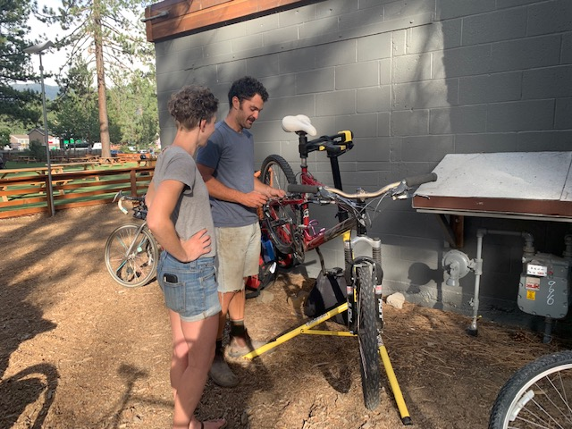 | `/images/2022/09/IMG_1635.jpg` 640x480, 129 KB | app/programs/bike-kitchen/page.tsx:33 (`gallery`) | Two volunteers adjusting a bike clamped in a repair stand | rendered by app/programs/bike-kitchen/page.tsx:129 |
|  | `/images/2022/09/IMG_2848.jpg` 1512x2016, 335 KB | app/programs/bike-kitchen/page.tsx:37 (`gallery`) | A volunteer cleaning a mountain bike on a repair stand under the pines | rendered by app/programs/bike-kitchen/page.tsx:129 |
|  | `/images/2022/09/unnamed.jpg` 1600x1200, 512 KB | app/programs/bike-kitchen/page.tsx:70 | Volunteers repairing bikes on work stands at an outdoor Bike Kitchen fix-up event |  |

## /programs/bike-valet

| Thumbnail | File | Used in | Alt text | Notes |
|---|---|---|---|---|
|  | `/images/2022/05/Bike-valet-in-action.jpg` 2400x1600, 863 KB | app/programs/bike-valet/page.tsx:12 | Volunteers checking bikes into a busy bike valet corral at a community event | Open Graph share image (`pageMetadata({ image })`); the alt is the og:image:alt tag |
|  | `/images/2022/05/Bike-valet-in-action.jpg` 2400x1600, 863 KB | app/programs/bike-valet/page.tsx:19 (`photos`) | Volunteers checking bikes into a busy bike valet corral at a community event | rendered by app/programs/bike-valet/page.tsx:98 |
|  | `/images/2022/05/Lakeview-Valet.jpg` 1600x1200, 350 KB | app/programs/bike-valet/page.tsx:23 (`photos`) | Rows of bicycles parked at the bike valet at Lakeview Commons | rendered by app/programs/bike-valet/page.tsx:98 |
| 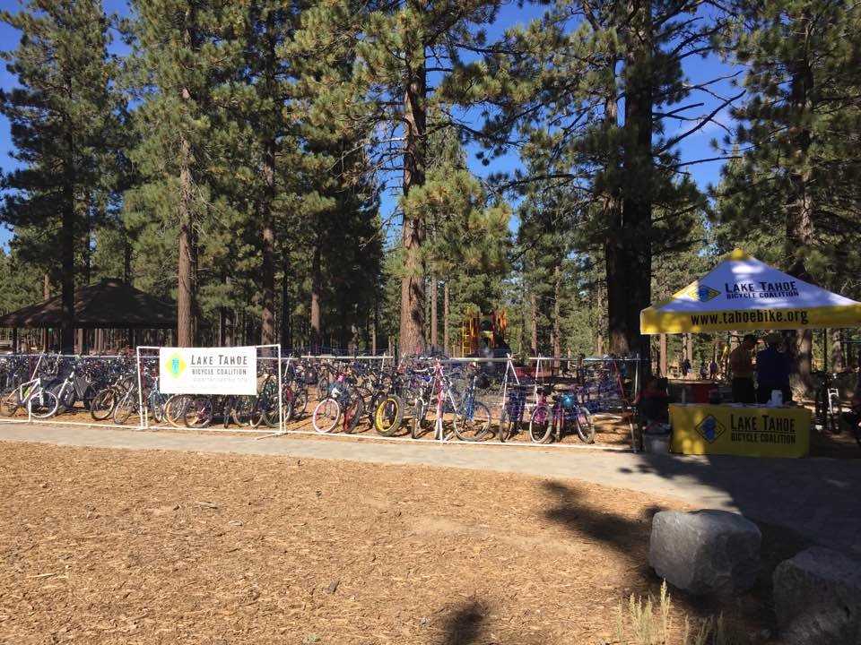 | `/images/2022/05/Bike-Valet-2016-Cycle-Celebration-3.jpg` 960x720, 136 KB | app/programs/bike-valet/page.tsx:27 (`photos`) | The bike valet tent and racks at the 2016 Cycle Celebration | rendered by app/programs/bike-valet/page.tsx:98 |
| 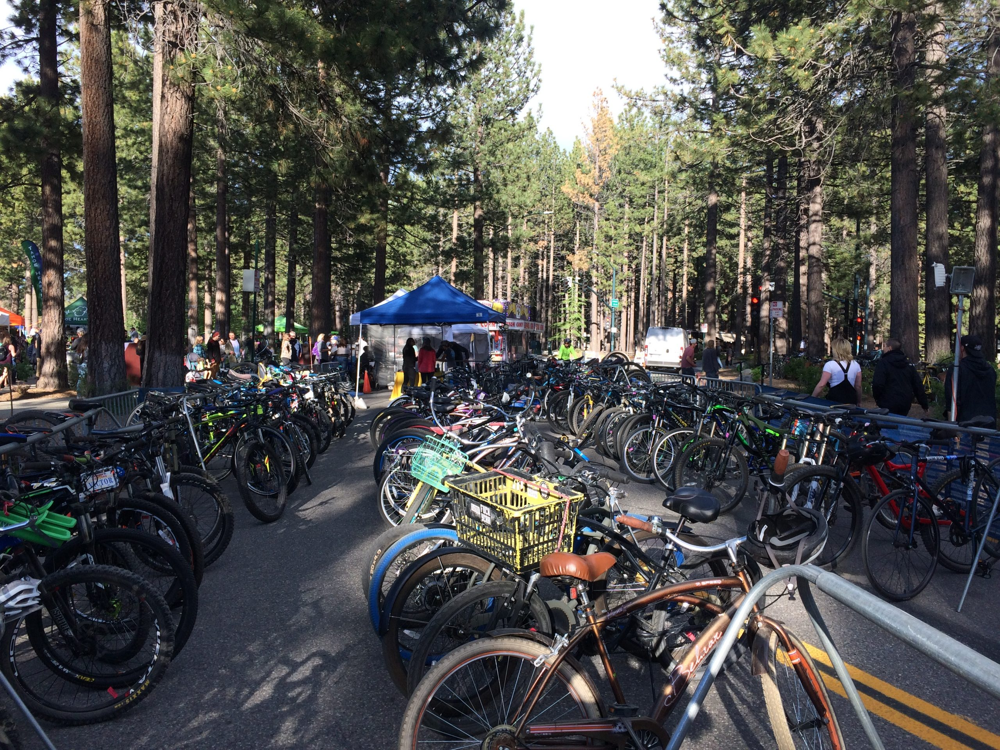 | `/images/2022/05/Bike-Valet_Live@Lakeview-2019.6-3.jpg` 2400x1800, 890 KB | app/programs/bike-valet/page.tsx:31 (`photos`) | Bikes lined up in the valet at a Live at Lakeview concert in 2019 | rendered by app/programs/bike-valet/page.tsx:98 |
| 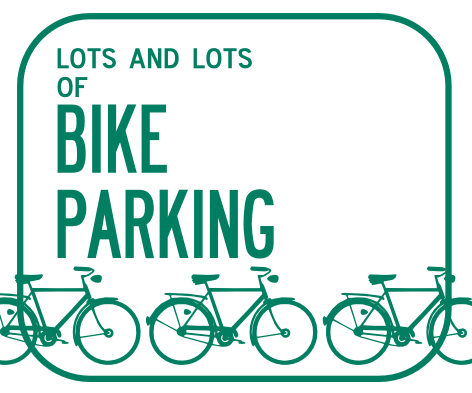 | `/images/2022/05/Bike-Valet-Main-Image.png` 472x393, 35 KB | app/programs/bike-valet/page.tsx:47 | Bike Valet: bicycles parked in a fenced valet corral |  |

## Icons and default share image

| Thumbnail | File | Used in | Alt text | Notes |
|---|---|---|---|---|
|  | `/images/brand/ltbc-emblem-512.png` 512x512, 138 KB | app/opengraph-image.tsx:18 | _decorative_ (`alt=""`) | drawn into the default Open Graph image (1200x630, yellow background, emblem plus the site name and tagline); the emblem's own alt inside the generated image is ""; the share image's alt is "Lake Tahoe Bicycle Coalition. Helping Tahoe become more bicycle friendly." |
| 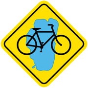 | `app/apple-icon.png` 180x180, 20 KB | Apple touch icon (Next.js file convention, served at /apple-icon.png) | _none_ | icons have no alt text; a 180x180 rendering of /images/brand/ltbc-emblem-512.png |
| 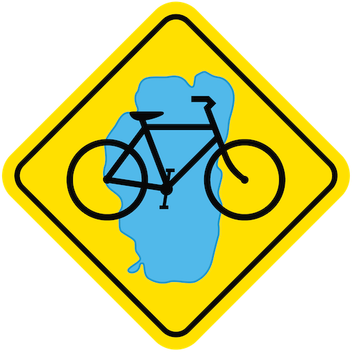 | `app/icon.png` 512x512, 138 KB | favicon (Next.js file convention, served at /icon.png) | _none_ | icons have no alt text; identical to /images/brand/ltbc-emblem-512.png |

## Unreferenced files in public/images

Nothing in app/, components/, the seeded rows or the icons references these. The dated folders were downloaded because the WordPress export referenced them somewhere (old sliders, footers, sponsor logos, unused attachments); each is still listed in content/image-map.json and its old `wp-content/uploads` URL redirects here (lib/redirects.generated.ts), so deleting one breaks inbound links to that file. Sponsor logos may be wanted back once sponsors are decided. Files under `brand/` are the source artwork for the icons and the share image and are kept on purpose.

| Thumbnail | File | Size |
|---|---|---|
| 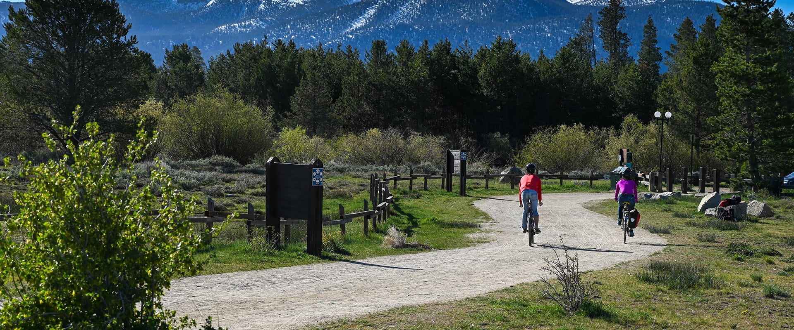 | `/images/2022/04/2020.05.07_Biking_Upper-Truckee-Marsh_California-Tahoe-Conservancy_DSC_2130-cropped.jpg` 1920x800 | 418 KB |
| 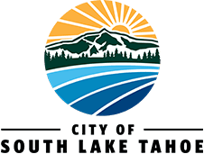 | `/images/2022/04/Document.png` 226x171 | 9 KB |
| 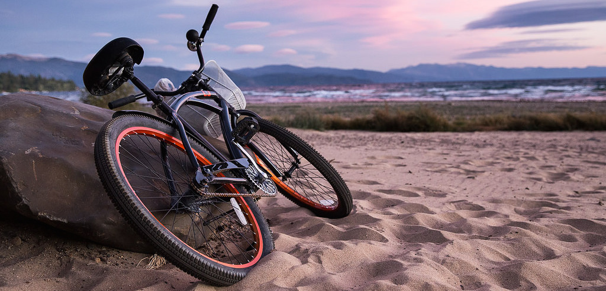 | `/images/2022/04/Sunset-cycle-by-Mike-Dean1.jpeg` 1024x493 | 230 KB |
|  | `/images/2022/04/TRPALogo_COLOR.png` 206x123 | 12 KB |
| 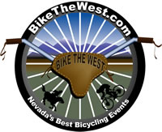 | `/images/2022/04/bike_the_west_200.jpeg` 200x163 | 12 KB |
| 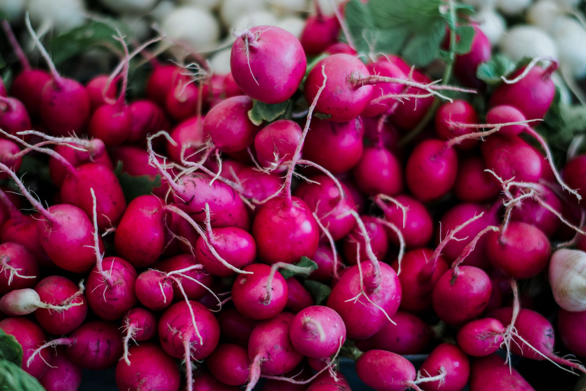 | `/images/2022/04/food_produce-10.jpg` 1920x1281 | 246 KB |
|  | `/images/2022/04/heavenly-ski-resort.gif` 2492x648 | 34 KB |
|  | `/images/2022/04/ncot_logo-thumb-1.jpeg` 737x300 | 42 KB |
| 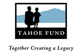 | `/images/2022/04/tahoe_fund.jpeg` 170x112 | 5 KB |
| 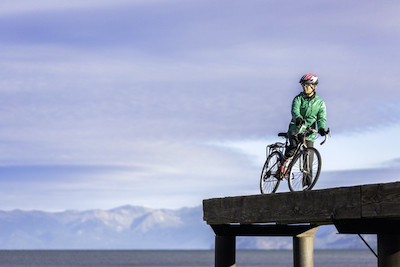 | `/images/2022/05/BSmeets_20141119_54170_Master.jpg` 400x267 | 77 KB |
|  | `/images/2022/05/Baldwin-Beach.jpg` 2400x1350 | 740 KB |
| 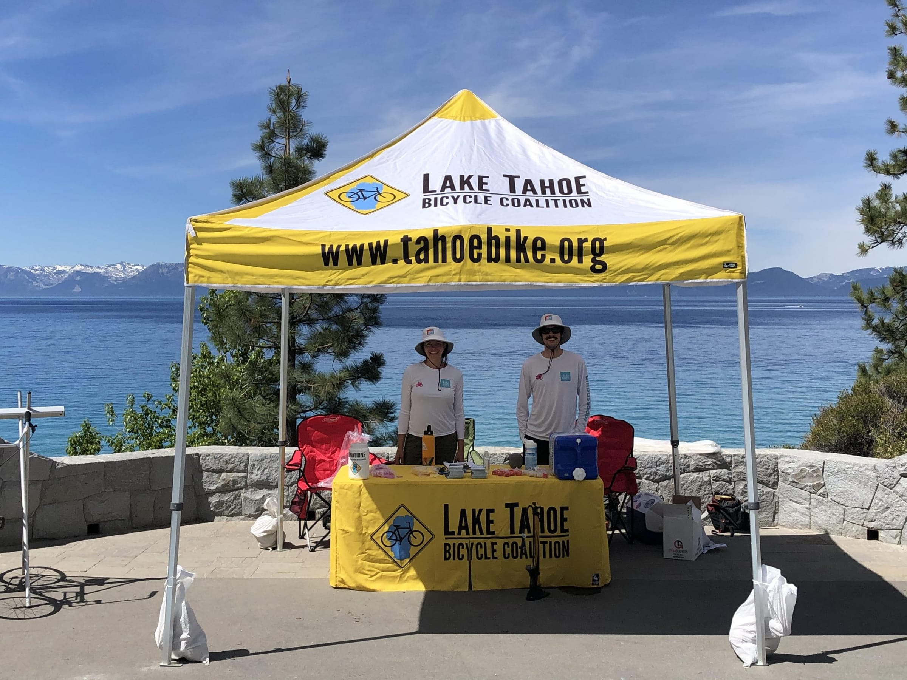 | `/images/2022/05/Bike-Ambassador-2021-East-Shore-path-1.jpg` 2400x1800 | 477 KB |
| 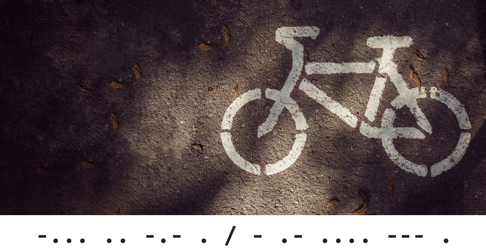 | `/images/2022/05/Bike-contact.png` 1489x767 | 701 KB |
| 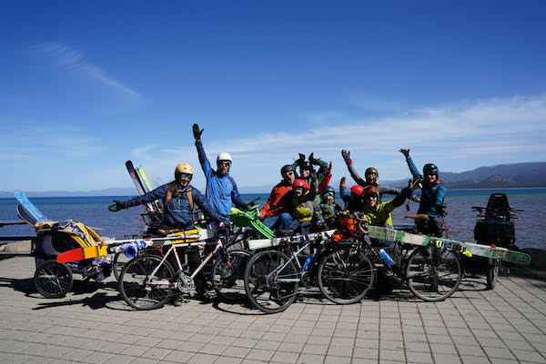 | `/images/2022/05/Bike-to-Ski-2022.04.10-2.jpg` 600x401 | 49 KB |
|  | `/images/2022/05/BtwLogoAndText2019-1.png` 2400x415 | 29 KB |
|  | `/images/2022/05/Clean-Tahoe.png` 456x281 | 122 KB |
| 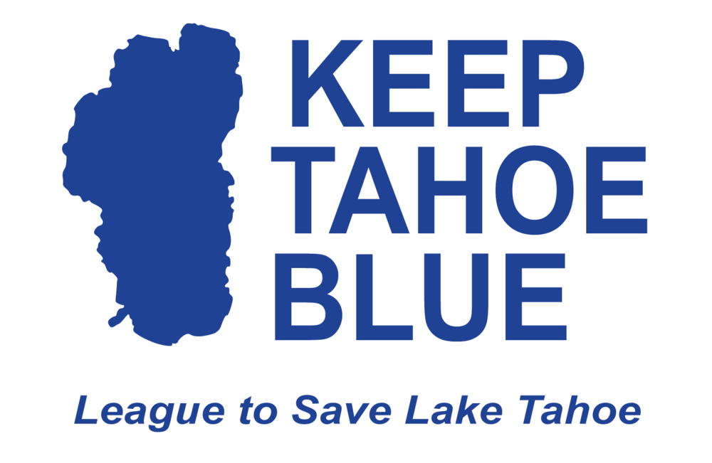 | `/images/2022/05/League-keep-tahoe-blue.png` 1000x651 | 72 KB |
|  | `/images/2022/06/Bike-the-West-logo.png` 540x93 | 5 KB |
| 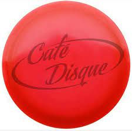 | `/images/2022/06/Cafe-Disque-logo.jpg` 225x224 | 5 KB |
|  | `/images/2022/06/Free-Bird-logo.jpg` 222x100 | 14 KB |
| 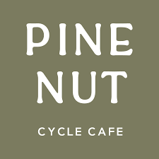 | `/images/2022/06/Pine-Nute-Cycle-Cafe-logo.png` 225x225 | 4 KB |
| 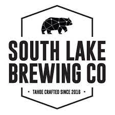 | `/images/2022/06/SLBC-logo.jpg` 225x225 | 8 KB |
|  | `/images/2022/06/STR-logo.png` 364x138 | 5 KB |
| 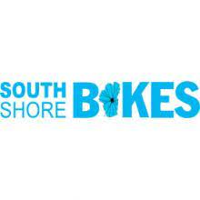 | `/images/2022/06/South-shore-bikes-logo.jpg` 220x220 | 4 KB |
|  | `/images/2022/06/whole-foods-logo.png` 225x225 | 7 KB |
|  | `/images/2023/05/Artboard-2@3x.png` 861x313 | 28 KB |
|  | `/images/2023/05/Stio_LTOI-Black-Green-2.png` 2400x1350 | 26 KB |
|  | `/images/2024/11/ltbc-logo-padded.png` 1080x1080 | 66 KB |
| 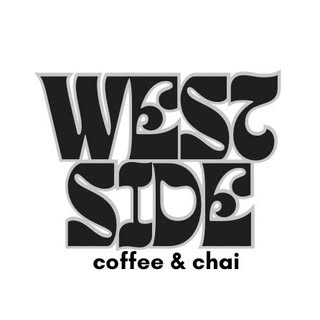 | `/images/2025/05/475490857_1138560471088216_2930324557237940262_n.jpg` 320x320 | 11 KB |
| 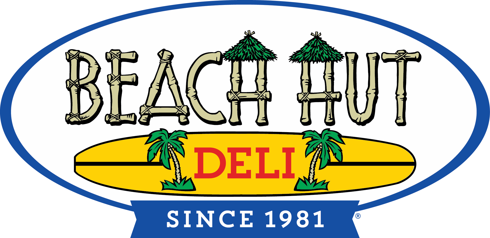 | `/images/2025/05/tmp_5888_5-3-2017_104036_.png` 2179x1059 | 255 KB |
| 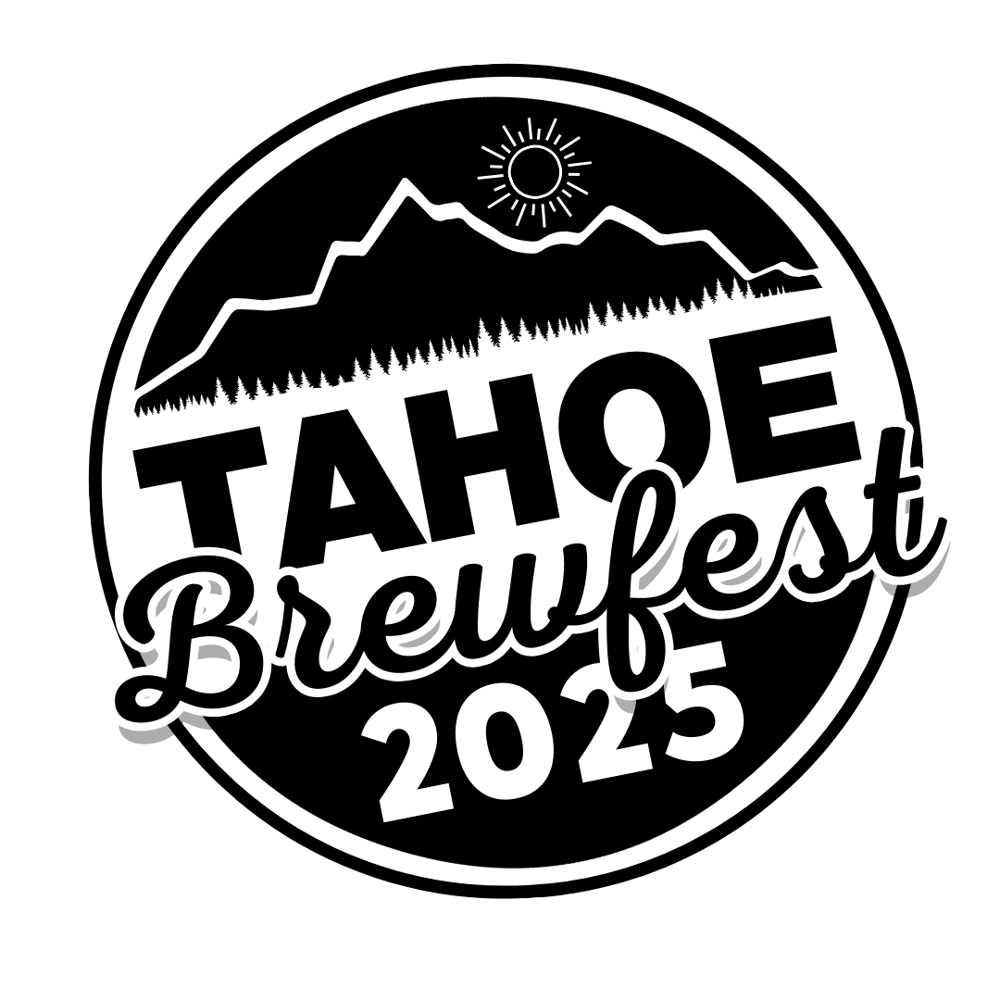 | `/images/2025/06/Tahoe-Brewfest-logo-2025-7.png` 1080x1080 | 144 KB |
|  | `/images/2025/06/sports-ltd.webp` 244x100 | 3 KB |
| 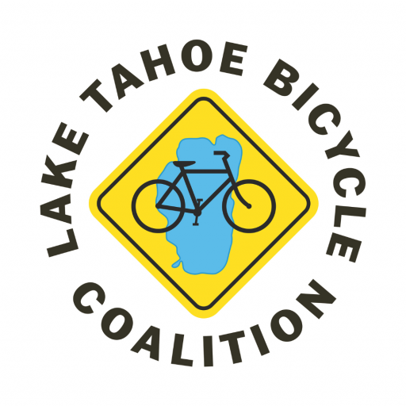 | `/images/brand/ltbc-circle-512.png` 512x512 | 185 KB |
| 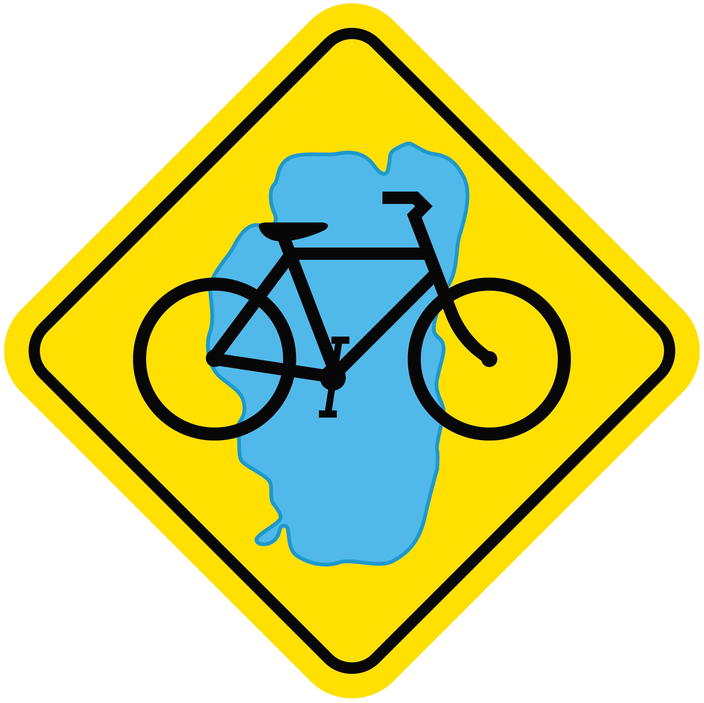 | `/images/brand/ltbc-emblem.png` 2133x2132 | 153 KB |

34 files, 4.20 MB in total.
